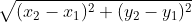

# Research Paper
Name: Chase Coogan\
Semester: Spring 2023\
Topic: K-Nearest-Neighbor (KNN)\
Link The Repository: [Chase Repo (may not link cause privage)](https://github.com/cwcoogan/CS5008-Research-Project)

## Introduction

The algorithm that I chose to work with and explore is the K-Nearest-Neighbor (KNN) Algorithm. KNN is a classification algorithm that is used to make predictions based on a given input sample size. KNN classifies data based based upon the distance found between (x, y) values across the test data and the validation data. When the distance is found, using KNN we can predict the labels of the validation data to classify the newly input data. 

KNN is widely used across many fields such as computer graphics, computer vision, image recognition & processing, healthcare and more. 

KNN calculates the distance between two objects with the formula:

- What is the algorithm/datastructure?
- What is the problem it solves? 
- Provide a brief history of the algorithm/datastructure. (make sure to cite sources)
- Provide an introduction to the rest of the paper. 

## Analysis of Algorithm/Datastructure
Make sure to include the following:
- Time Complexity
- Space Complexity
- General analysis of the algorithm/datastructure

## Empirical Analysis
- What is the empirical analysis?
- Provide specific examples / data.

## Application
- What is the algorithm/datastructure used for?
- Provide specific examples
- Why is it useful / used in that field area?
- Make sure to provide sources for your information.

## Implementation
- What language did you use?
- What libraries did you use?
- What were the challenges you faced?
- Provide key points of the algorithm/datastructure implementation, discuss the code.
- If you found code in another language, and then implemented in your own language that is fine - but make sure to document that.

## Summary
- Provide a summary of your findings
- What did you learn?