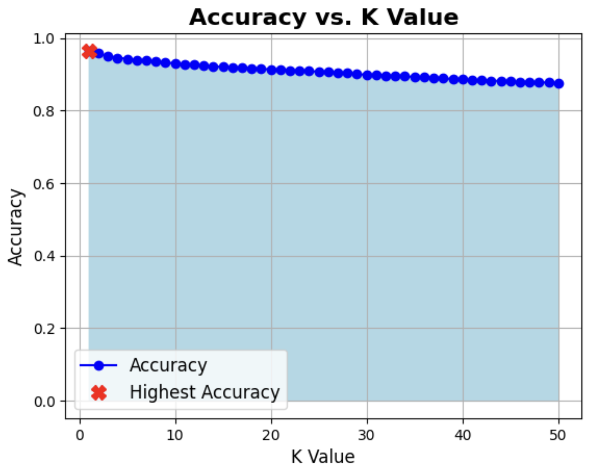

# Research Paper
 \
Name: Chase Coogan\
Semester: Spring 2023\
Topic: K-Nearest-Neighbor (KNN)\
Link The Repository: [Chase Repo (may not link cause rep is private)](https://github.com/cwcoogan/CS5008-Research-Project)
____

## Introduction

K-Nearest-Neighbor (KNN) is a supervised machine learning algorithm that is used in both classification and regression problems that relies on labeled data to predict outputs. In classification, KNN is used to predict the labels or classes for the newly input validation data based on similarity. In regression problems, KNN is used to predict real numbers or continous values for a given dataset. KNN is widely used across many fields such as computer graphics, computer vision, image recognition & processing, healthcare and more. 

The KNN Algorithm believes that similar objects exist within a close proximity to one another. The way KNN predicts labels, or values is by sampling data and finding the nearest neighbor to K. To do so in KNN, we must calculate the distance between the sample data and the validation data. We can use the distance to find the nearest Neighbor to the validation data, and with this given neighbor, we can test different "K" values to predict it's label or value. Choosing a K value is an art in itself. Typically, we start with K = 1, and then test different values. Common practices include: dividing the labels in half and using the next odd number. Another way is by taking the square root of the validation data. Once we have found our nearest neighbor(s), we run the algorithm on given "K" values, and predict the outcome by counting re-occuring labels or values. 

The research I conducted on KNN uses the MNIST dataset, a widely popular open-source classification data set used to train models on hand-drawn images based on pixel values in computer vision to predict their true numerical value. This paper seeks to explore the difference in the Algorithm and it's accuracy as "K" changes. Additionally it aims to explore how the output label predictions change as the sample and validation data changes.
___


## Analysis of Algorithm/Datastructure

The time complexity of KNN depends on the way the Algorithm is implemented. In my case, KNN ran at a time complexity of $O(n log n)$, and holds a space complexity of $O(n)$. To calculate the complexity, KNN considers the test data size, the number of features, and the distance. I used the Euclidean Distance formula to calculate the distance between my training and validation data with sci-kits library. The Euclidean Distance formula is:

$$\text{Euclidean Distance} = \sqrt{(x_2 - x_1)^2 + (y_2 - y_1)^2}$$ 

Calculating the distance is an important aspect of KNN as we need to use it to locate the distance between the training data & the validation data. I used numpy's argsort() function to sort by index to locate the closest neighbors to the validation data.

``` Python
distance = euclidean_distances(x_testData, trainingData)
sorted_distance = np.argsort(distance, axis=1) 

```
___


## Empirical Analysis

I ran three different scenarios of my sample data to test the accuracy at larger input sizes. The sizes I sampled were 10,000 training inputs and 5,000 validation, 30,000 training inputs and 20,000 validation, and 50,000 training inputs and 20,000 validation. I ran my K value from 1-50 to see the accuracy amongst each sample size.

I found that as the number of test inputs increased, the Label predictions as well as accuracy strongly increased. 

## K Accuracy vs. Sample Size

I found that as my sample sizes increases, my algorithm is able to predict higher accuracy. This is due to the test sample size increases, and using a validation set relative to it. In the KNN Algorithm the K value is most optimal where there is least margin for error. With a lower K value, the variance grows, opposed to when the K value is higher the variance falls off. The highest accuracy I found was when K = 3 at 96% accuracy shown below.

<p align="center">

| K   | Sample Size: 10k | Sample Size: 30k | Sample Size: 50k |
|:--- |:-------------|:-------------|:-------------|
| 0   | 0.9450      | 0.9567      | 0.9647      |
| 10  | 0.9330      | 0.9492      | 0.9573      |
| 20  | 0.9235      | 0.9447      | 0.9506      |
| 30  | 0.9150      | 0.9397      | 0.9458      |
| 40  | 0.9085      | 0.9347      | 0.9428      |
| 50  | 0.9015      | 0.9333      | 0.9400      |
| 60  | 0.8970      | 0.9298      | 0.9381      |
| 70  | 0.8925      | 0.9258      | 0.9356      |
| 80  | 0.8850      | 0.9222      | 0.9324      |
| 90  | 0.8810      | 0.9193      | 0.9302      |
| 100 | 0.8760      | 0.9165      | 0.9278      |

</p>


Image showcases the highest K value occurs when the variance is the highest. As variance falls off, we can see the value of K's accuracy decrease.


<p align="center">
  
</p>

## Label Predictions

KNN Algorithm follows a "majority_vote" method to calculate the predictions of the labels when multiple neighbors with difference labels are within the K range. KNN counts the number of similar labels within the K range and assigns a label based upon the similarity and distance between the neighbors to the validation data.

<center><table>
<tr>
<br>
<td>
<center><strong>Sample Size: 10k</strong></center>

| True Label | Prediction |
|:-------|:------------|
|   5   |      6     |
|   0   |      2     |
|   4   |      7     |
|   1   |      4     |
|   9   |      4     |
|   2   |      2     |
|   1   |      1     |
|   3   |      2     |
</td>

<br>
<td>
<center><strong>Sample Size: 30k</strong></center>

| True Label | Prediction |
|-------|------------|
|   5   |      7     |
|   0   |      3     |
|   4   |      4     |
|   1   |      1     |
|   9   |      1     |
|   2   |      6     |
|   1   |      3     |
|   3   |      0     |
</td>

<br>
<td>
<center><strong>Sample Size: 50k</strong></center>

| True Label | Prediction |
|-------|------------|
|   5   |      7     |
|   0   |      3     |
|   4   |      4     |
|   1   |      1     |
|   9   |      1     |
|   2   |      2     |
|   1   |      3     |
|   3   |      3     |
</td>
</tr>

</table></center>


What we see is as the sample size increases from our training data, the predicted labels begin to become more accurate against their true labels. We can correlate this to the chart above showcasing the accuracy based on K. 


```Python
# Majority Count Algorithm With the Predicted (Majority Vote) function
def KNN(x, y, dist, k):
  num_test = len(dist)
  predicted_labels = []
  for i in range(num_test):
    neighbors = dist[i, :k] 
    labels = y[neighbors]
    p = predict(labels,k)
    predicted_labels.append(p)
  return predicted_labels

def predict(nLabels, k):
    unique_labels, counts = np.unique(nLabels, return_counts=True)
    majority_label = unique_labels[np.argmax(counts)]  
    return majority_label
```

____


## Application

K-Nearest-Neighbor is used for many different applications. Primarily, it is used in Machine Learning for solving classification or Regression problems. Some of the common areas where KNN is most relevant are in computer vision/graphics, and healthcare. In my example, I applied it to a classification model for labeling. KNN is a widely-used model that can be found in sentiment analysis, medical diagnosis, stock pricing, temperature predictions, and many more. 

___


## Implementation

I implemented KNN with the Python language. The challenges that I faced were making sure that my model was accurate as well as making sure the neighbors relevant to my distance were accurate. In KNN, the model needs to pull the index of the closest neighbor to the validation data and assign labels to them. This was the first time that I explored a Machine Learning Algorithm and were new to understanding how the model trains based on test data. To overcome this, I explored ways to validate the predicted validation labels against their true labels.

I used various different libraries to learn about KNN. Each of my imports can be found at [KNN](MNIST.ipynb). The most relevant libraries included: sci-kit to import the MNIST data, and to use the Euclidean Distance function, numpy and pandas to take advantage of np arrays and dataframes. I used both matplotlib and seaborn for charting and visualizations.

KNN is an intricate algorithm that depends on the cleanliness of your data. There are many different ways to implement KNN or to speed it up using different distance calculations or different tree structures to store relevant distances. I found the Euclidean Distance formula to be the most accurate way to find true distance in the fastest complexity. I found this because, the sci-kit library uses KD-Tree's to organize data in k-dimensional space. In a KD-Tree the features are organized in a hierarchical structure which allows us to eliminate the search space for unlikely k-nearest-neighbors.


Below shows how KNN data is selected for x_train and validation data:

```Python
# slice the data for the selected range of TRAINING data. (capped at 50k)
x_testData = mnist.data[:50000]
```

```Python
# Slice the data for the selected range of VALIDATION data. (cappted at 20k && must be smaller than TRAINING data)
trainingData = mnist.data[50001:70001] 
y_validation = mnist.target[50001:70001] 
```

```Python
# Assign the VALIDATION data labels
y_labelData = mnist.target[:50000] 
```

___


## Summary

As a result, I found that as K increases, the variance between accuracy rating drops off. I found that if we keep K constant, and change our sample data size and validation size, that the accuracy increases as there is more data to train with. The algorithm is efficient with a runtime of $O(n log n)$. As a result, I found that as the sample size increases and we check the predicted labels to their true labels, the error margin off false positives falls off, and we are left with more accurate predictions. This data can be found in the [knn_results](knn_results) folder.

This research report taught me a lot about how KNN can be used to predict labels of unknown data. I had very little knowledge beforehand about Machine Learning, Modeling, Dataframes, or any form of modeling/training datasets. Through this, I learned a new ability to apply code to a different area to predict labels or values.

___

## How to Run:

1. Clone the repository in your IDE
2. Navigate to [knn](MNIST.ipynb)
3. "Play" each code block starting from the imports
4. Play around with different MNIST Data & Sample sizes (refer to notebook comments to change data ranges)
5. Change K values around 
6. Check text output files for results

___

## Code Links

* [KNN Algorithm](/MNIST.ipynb)
* [Images](/images)
* [Results](/knn_results)